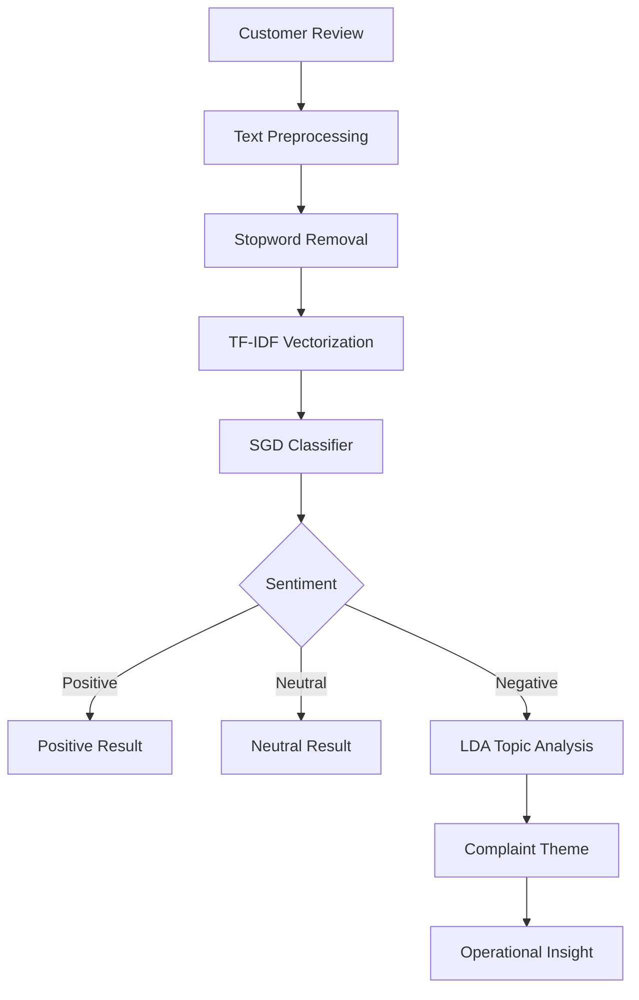
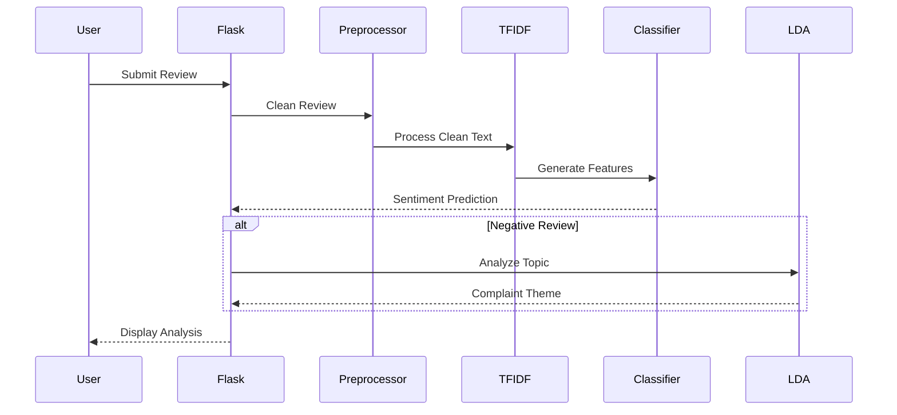

# Review Analyzer

A machine learning powered customer review analysis system that classifies customer feedback by sentiment and identifies the major complaint themes behind negative reviews.

The project combines Natural Language Processing, TF-IDF feature extraction, a Stochastic Gradient Descent classifier, and Latent Dirichlet Allocation to transform raw customer reviews into meaningful operational insights.

---

## Overview

Customer reviews contain valuable information about product quality, service experience, usability, and customer expectations. Manually analyzing thousands of reviews is time-consuming and difficult to scale.

Review Analyzer automates this process by:

- Cleaning and preprocessing customer review text
- Converting text into numerical features using TF-IDF
- Classifying reviews into Positive, Negative, or Neutral sentiment
- Detecting major complaint themes from negative reviews
- Providing the analysis through a simple Flask web interface

The system is designed around customer feedback similar to e-commerce reviews and focuses on extracting actionable information from negative feedback.

---

## Features

### Sentiment Classification

The system classifies customer reviews into three categories:

| Sentiment | Description |
|---|---|
| Positive | Review expresses satisfaction or a favorable experience |
| Negative | Review expresses dissatisfaction or a poor experience |
| Neutral | Review contains neither clearly positive nor negative sentiment |

### Complaint Theme Detection

For negative reviews, the system performs additional topic analysis using LDA.

The current complaint categories include:

- Overall Experience & Expectation Gap
- Performance & Usability Failure
- Return / Flipkart Service Issue
- Defective Build / Poor Quality
- Value for Money / Dead on Arrival

### Text Preprocessing

Before classification, review text is processed through:

1. Lowercase conversion
2. Removal of non-alphabetic characters
3. Stop-word removal
4. Removal of very short tokens
5. TF-IDF vectorization

### Web Interface

The project provides a Flask-based web interface where users can enter a customer review and immediately receive:

- Predicted sentiment
- Complaint theme for negative reviews
- Original review text

---

## System Architecture



---

## Machine Learning Pipeline

```text
Customer Review
       |
       v
Text Cleaning
       |
       v
Token Filtering
       |
       v
TF-IDF Feature Extraction
       |
       v
SGD Classification
       |
       +----------------------+
       |          |           |
       v          v           v
    Positive    Neutral    Negative
                              |
                              v
                       LDA Topic Model
                              |
                              v
                       Complaint Theme
```

---

## Technology Stack

| Category | Technology |
|---|---|
| Programming Language | Python |
| Web Framework | Flask |
| Machine Learning | Scikit-learn |
| NLP | NLTK |
| Feature Extraction | TF-IDF |
| Sentiment Classifier | SGD Classifier |
| Topic Modeling | Latent Dirichlet Allocation |
| Model Serialization | Joblib |
| Data Processing | Pandas, NumPy |
| Visualization | Matplotlib, Seaborn |
| Word Analysis | WordCloud |
| Development | Jupyter Notebook / Google Colab |

---

## Project Structure

```text
review-analyzer/
|
├── app.py
├── customer_review_classifier.ipynb
├── requirements.txt
├── readme.md
├── .gitignore
|
├── models/
│   ├── tfidf_vectorizer.pkl
│   ├── sgd_classifier.pkl
│   └── lda_topic_model.pkl
|
├── outputs/
|
├── src/
|
└── templates/
    └── index.html
```

---

## How It Works

### 1. User Input

The user enters a customer review through the web interface.

Example:

```text
The product stopped working after two days. The build quality is very poor and I would not recommend buying it.
```

### 2. Text Preprocessing

The application converts the review into a normalized representation by:

- Converting text to lowercase
- Removing unnecessary characters
- Removing common stop words
- Removing tokens with very few characters

### 3. TF-IDF Transformation

The cleaned review is transformed into numerical features using the trained TF-IDF vectorizer.

TF-IDF helps the model identify words that are important within the review while reducing the importance of extremely common words.

### 4. Sentiment Prediction

The transformed review is passed to the trained SGD classifier.

The classifier predicts one of:

```text
Positive
Negative
Neutral
```

### 5. Complaint Analysis

If the prediction is `Negative`, the review is passed through the trained LDA topic model.

The dominant topic is then mapped to a human-readable complaint category.

Example:

```text
Sentiment:
Negative

Complaint Theme:
Defective Build / Poor Quality
```

---

## Installation

### Clone the Repository

```bash
git clone https://github.com/robingilbert1844-cmyk/review-analyzer.git
```

Navigate into the project:

```bash
cd review-analyzer
```

---

## Create a Virtual Environment

### Windows

```bash
python -m venv venv
```

Activate the environment:

```bash
venv\Scripts\activate
```

### Linux / macOS

```bash
python3 -m venv venv
```

Activate:

```bash
source venv/bin/activate
```

---

## Install Dependencies

```bash
pip install -r requirements.txt
```

The project uses libraries for:

- Data processing
- Natural Language Processing
- Machine Learning
- Visualization
- Model persistence

---

## Run the Application

Start the Flask application:

```bash
python app.py
```

The application runs on:

```text
http://127.0.0.1:5000
```

Open the address in a web browser and enter a customer review.

---

## Example

### Input

```text
Worst quality product. It stopped working within two days and the build feels extremely cheap.
```

### Output

```text
Identified Sentiment: Negative

Operational Complaint Theme:
Defective Build / Poor Quality
```

Another example:

### Input

```text
The product works perfectly and the quality is excellent. Very happy with the purchase.
```

### Output

```text
Identified Sentiment: Positive
```

---

## Model Components

### TF-IDF Vectorizer

TF-IDF is used to convert textual reviews into numerical feature vectors that can be processed by the machine learning classifier.

The trained vectorizer is stored in:

```text
models/tfidf_vectorizer.pkl
```

### SGD Classifier

A Stochastic Gradient Descent classifier is used for sentiment classification.

The trained classifier is stored in:

```text
models/sgd_classifier.pkl
```

### LDA Topic Model

Latent Dirichlet Allocation is used to identify the dominant topic associated with negative reviews.

The topic model and its vectorizer are stored in:

```text
models/lda_topic_model.pkl
```

---

## Training Workflow

The machine learning workflow is implemented in:

```text
customer_review_classifier.ipynb
```

The notebook contains the development and experimentation workflow used to prepare the review classification system.

The general process is:

```text
Dataset
   |
   v
Data Cleaning
   |
   v
Text Preprocessing
   |
   v
Exploratory Data Analysis
   |
   v
TF-IDF Feature Extraction
   |
   v
Model Training
   |
   v
Sentiment Classification
   |
   v
LDA Topic Modeling
   |
   v
Model Serialization
```

---

## Application Workflow



---

## Use Cases

Review Analyzer can be used for:

- E-commerce review analysis
- Customer feedback monitoring
- Product quality analysis
- Complaint identification
- Customer experience analysis
- Product improvement research
- Automated review classification
- NLP and machine learning demonstrations

---

## Key Advantages

### Automated Analysis

Large amounts of customer feedback can be processed automatically instead of manually reviewing every comment.

### Two-Level Analysis

The system does more than classify sentiment. Negative reviews are further analyzed to identify potential operational complaint areas.

### Lightweight Deployment

The application uses traditional machine learning models rather than large deep-learning models, making it relatively lightweight and suitable for local deployment.

### Simple Interface

The Flask frontend provides a straightforward interface for entering reviews and viewing predictions.

---

## Future Improvements

Potential improvements include:

- Add confidence scores to predictions
- Support multiple languages
- Add product review batch analysis
- Support CSV upload
- Add review statistics and dashboards
- Add sentiment distribution charts
- Improve topic classification
- Add transformer-based NLP models
- Compare multiple classification algorithms
- Add model performance metrics
- Add REST API endpoints
- Add database support
- Deploy the application to a cloud platform
- Add product-level sentiment aggregation
- Detect fake or suspicious reviews
- Add keyword and aspect-based sentiment analysis

---

## Limitations

The current implementation has several limitations:

- The classifier depends on the quality and distribution of its training data.
- Topic labels are manually mapped to LDA topic IDs.
- The current preprocessing pipeline is primarily designed for English text.
- Predictions may be less reliable for reviews that differ significantly from the training data.
- LDA topics may not always perfectly represent the actual complaint described by a customer.
- The current interface is designed for individual review analysis rather than large-scale batch processing.

---

## Development

The project follows a modular structure where:

```text
Machine Learning
       |
       v
Serialized Models
       |
       v
Flask Backend
       |
       v
HTML Interface
       |
       v
User Prediction
```

This separation makes it possible to retrain the machine learning models without significantly changing the Flask application.

---

## Requirements

The project requires Python and the dependencies listed in:

```text
requirements.txt
```

Main dependencies include:

```text
pandas
numpy
nltk
scikit-learn
joblib
matplotlib
seaborn
wordcloud
```

---

## Contributing

Contributions are welcome.

To contribute:

```bash
git clone https://github.com/robingilbert1844-cmyk/review-analyzer.git
cd review-analyzer
```

Create a new branch:

```bash
git checkout -b feature/your-feature
```

Make your changes, test the application, and commit:

```bash
git add .
git commit -m "Add your feature"
```

Push the branch:

```bash
git push origin feature/your-feature
```

Then open a pull request describing the changes.

---

## Project Goals

The primary goal of Review Analyzer is to demonstrate how traditional Natural Language Processing and machine learning techniques can be combined with a web application to convert unstructured customer reviews into useful information.

The project demonstrates a complete machine learning application workflow:

```text
Data
  |
  v
Preprocessing
  |
  v
Feature Engineering
  |
  v
Model Training
  |
  v
Model Persistence
  |
  v
Flask Integration
  |
  v
Interactive Prediction
```

---

## License

This project is intended for educational, research, and development purposes.

---

## Repository

https://github.com/robingilbert1844-cmyk/review-analyzer

---

## Built With

```text
Python
Flask
Scikit-learn
NLTK
Pandas
NumPy
Joblib
TF-IDF
SGD
LDA
HTML
CSS
```
